# dokit

Just do kit!

#### 项目简介
基于 Spring Boot 2.1.9 、 Jpa、 Spring Security、redis、Vue的前后端分离的后台管理系统， 权限控制的方式为RBAC，项目支持数据字典与数据权限管理，支持一键生成前后端代码，支持前端菜单动态路由

####  系统功能
- 用户管理：提供用户的相关配置，新增用户后，默认密码为123456
- 角色管理：对权限与菜单进行分配，可根据部门设置角色的数据权限
- 菜单管理：菜单动态路由，后端可配置化，支持多级菜单
- 部门管理：可配置系统组织架构，树形表格展示
- 岗位管理：配置各个部门的职位
- 字典管理：可维护常用一些固定的数据，如：状态，性别等
- 操作日志：记录用户操作的日志
- 异常日志：记录异常日志，方便开发人员定位错误，异常信息前台高亮显示
- 系统缓存：使用jedis将缓存操作可视化，并提供对redis的基本操作，可根据需求自行扩展
- SQL监控：采用druid 监控数据库访问性能，默认用户名admin，密码123456
- 定时任务：整合Quartz做定时任务，加入任务日志，任务运行情况一目了然
- 代码生成：高灵活度一键生成前后端代码，减少百分之80左右的工作任务，可以预览生成结果
- 邮件工具：配合富文本，发送html格式的邮件
- 免费图床：使用sm.ms图床，用作公共图片上传使用
- 七牛云存储：可同步七牛云存储的数据到系统，无需登录七牛云直接操作云数据
- 支付宝支付：整合了支付宝支付并且提供了测试账号，可自行测试
- 在线用户：查看实时在线用户，可以管理在线用户，踢下线等操作
- 服务器： 可以连接云服务器进行管理
- 数据库管理： 连接数据方便更新数据库脚本
- 应用管理：上次jar包到服务器进行管理
- 部署管理：可一键部署，根据配置的服务器和应用程序，线上直接配置，无需命令行

#### 项目结构
```
后端
.
├── main
│   ├── java
│   │   └── com
│   │       └── perye
│   │           └── dokit
│   │               ├── DokitApplication.java       应用启动类
│   │               ├── annotation                  自定义注解
│   │               ├── aop                     
│   │               ├── aspect
│   │               ├── base
│   │               ├── config
│   │               ├── controller
│   │               ├── dto
│   │               ├── entity
│   │               ├── exception
│   │               ├── mapper
│   │               ├── redis
│   │               ├── repository
│   │               ├── security
│   │               ├── service
│   │               ├── swagger2
│   │               ├── task
│   │               ├── utils
│   │               ├── vo
│   │               └── websocket
│   └── resources
│       ├── banner.txt
│       ├── config
│       │   ├── application-dev.yml
│       │   ├── application-prod.yml
│       │   └── application.yml
│       ├── generator.properties
│       ├── ip2region               ip转换
│       │   └── ip2region.db
│       ├── log4jdbc.log4j2.properties
│       ├── logback.xml
│       ├── sigar-lib               sigar所需文件
│       ├── sql
│       │   └── dokit.sql           sql文件
│       └── template
│           ├── email
│           │   └── email.ftl       发送邮件模版
│           └── generator           自动生成代码模版    
│               ├── admin       
│               │   ├── Controller.ftl
│               │   ├── Dto.ftl
│               │   ├── Entity.ftl
│               │   ├── Mapper.ftl
│               │   ├── QueryCriteria.ftl
│               │   ├── Repository.ftl
│               │   ├── Service.ftl
│               │   └── ServiceImpl.ftl
│               └── front
│                   ├── api.ftl
│                   └── index.ftl
└──
```

```
前端
.
├── LICENSE
├── README.md
├── babel.config.js
├── jest.config.js
├── package.json
├── plopfile.js
├── postcss.config.js
├── public
│   ├── favicon.ico
│   └── index.html
├── src
│   ├── App.vue
│   ├── api
│   ├── assets
│   ├── components
│   │   ├── Breadcrumb
│   │   ├── Crud
│   │   ├── Dict
│   │   ├── Echarts
│   │   ├── Hamburger
│   │   ├── HeaderSearch
│   │   ├── IconSelect
│   │   ├── Iframe
│   │   ├── JavaEdit
│   │   ├── Pagination
│   │   ├── PanThumb
│   │   ├── Permission
│   │   ├── RightPanel
│   │   ├── Screenfull
│   │   ├── SizeSelect
│   │   ├── SvgIcon
│   │   ├── ThemePicker
│   │   └── YamlEdit
│   ├── layout
│   ├── main.js
│   ├── mixins
│   ├── router
│   ├── settings.js
│   ├── store
│   ├── utils
│   └── views
│       ├── components
│       ├── dashboard
│       ├── features
│       ├── generator
│       ├── home.vue
│       ├── login.vue
│       ├── mnt
│       ├── monitor
│       ├── system
│       └── tools
├── static
├── tree.txt
├── vue.config.js
└── yarn.lock

```

#### 项目截图

用户管理
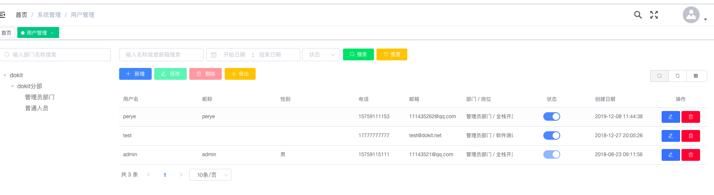

角色管理及菜单分配
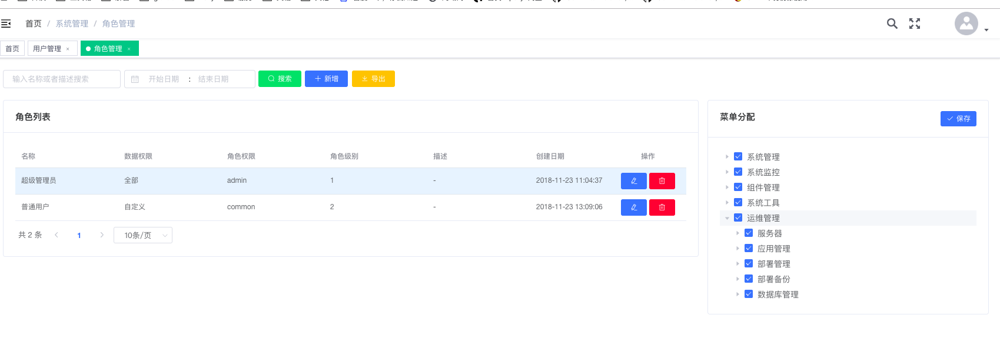

菜单管理
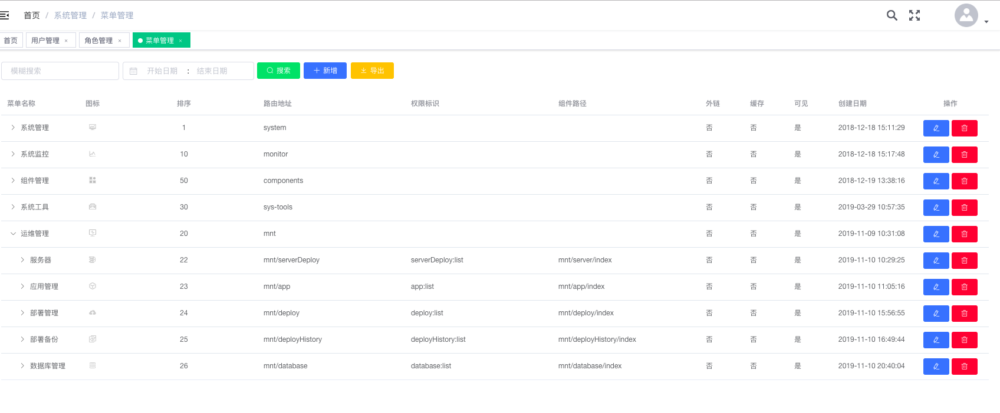

部门管理
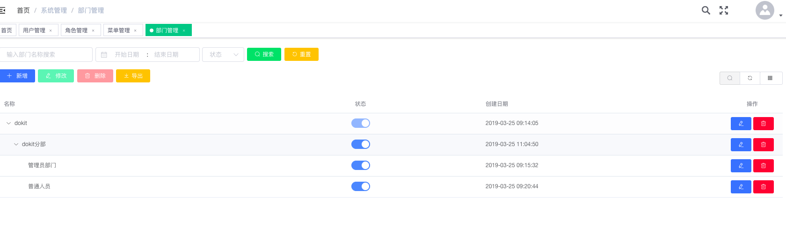

岗位管理
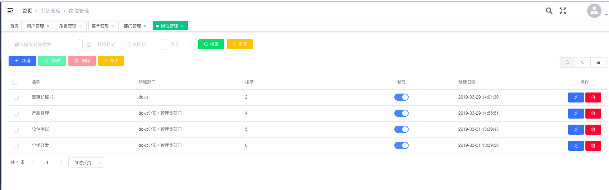

字典管理
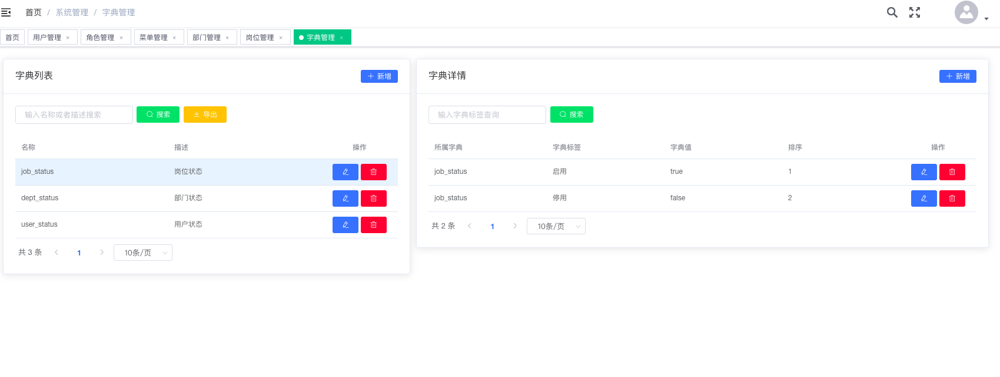

在线用户


操作日志
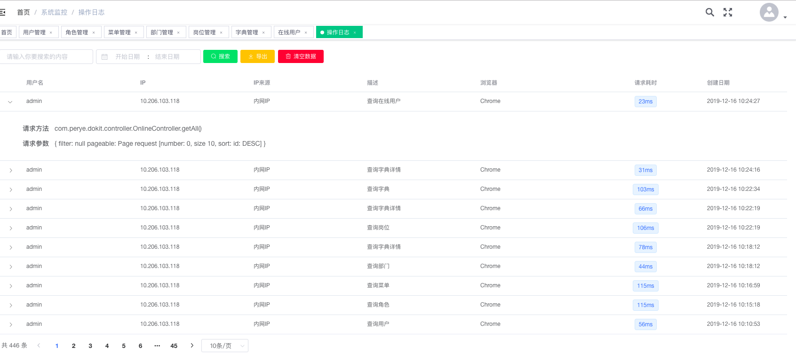

错误日志
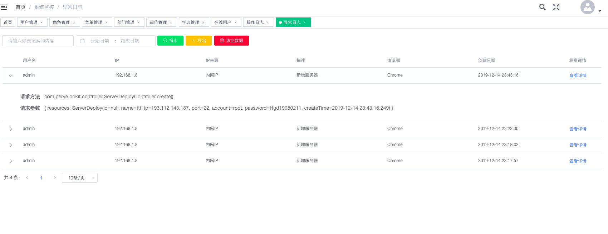

错误日志详情
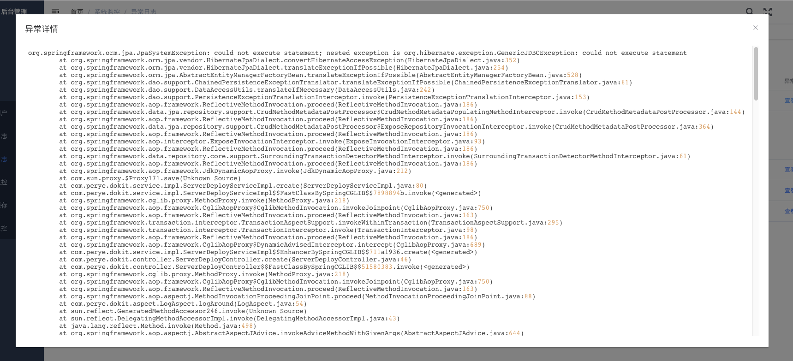

服务监控
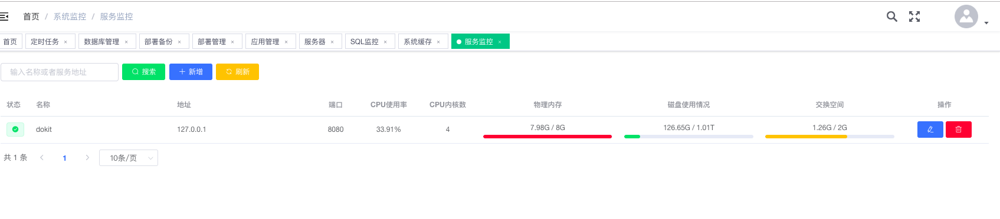

系统缓存
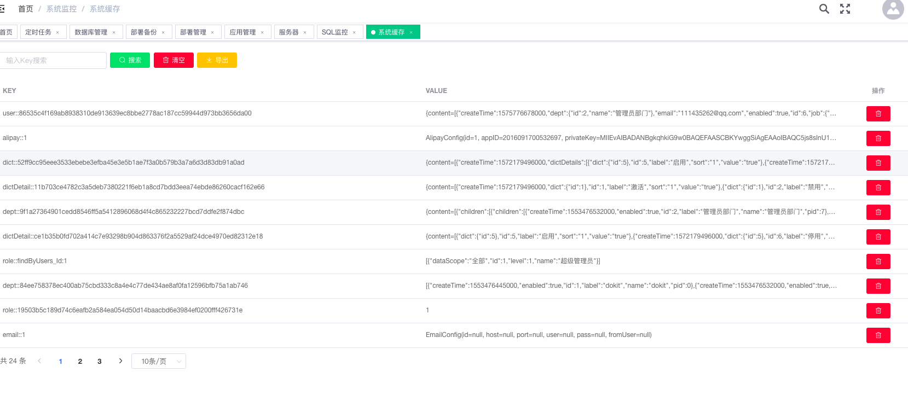

sql监控
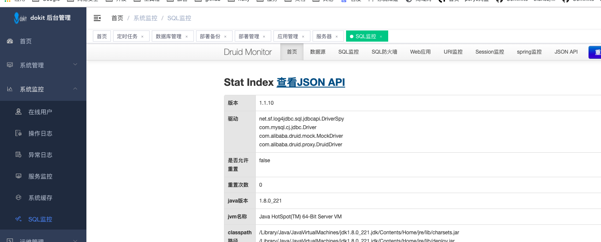

服务器


应用管理
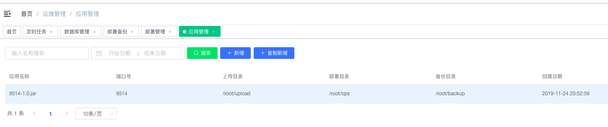

部署管理
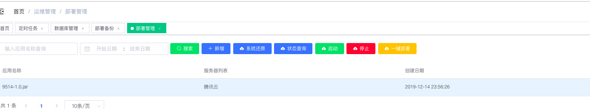

部署备份


数据库管理
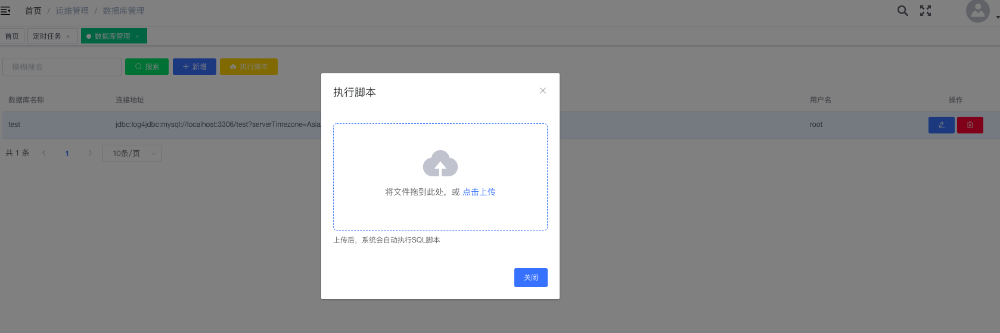

定时任务


代码生成


图床管理
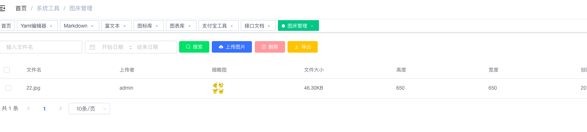

接口文档
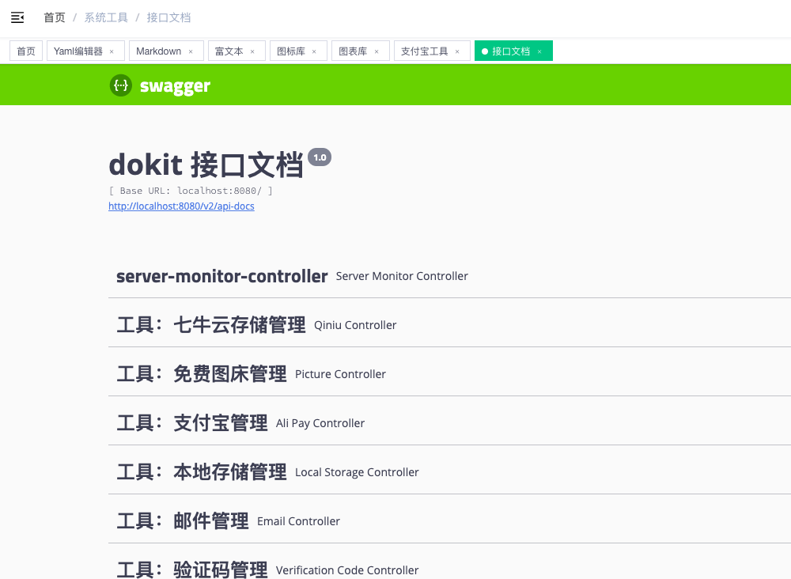

图表库
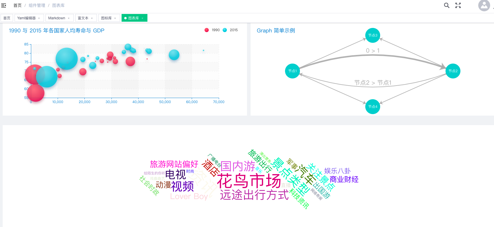

图标库
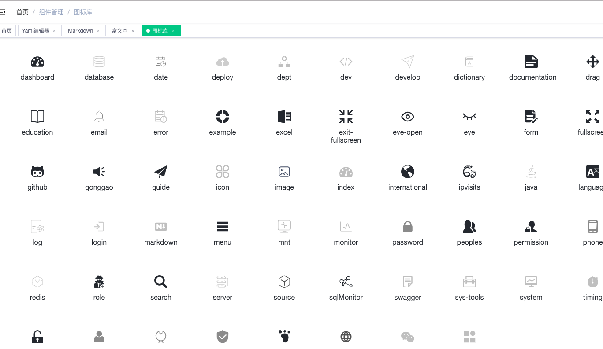

富文本
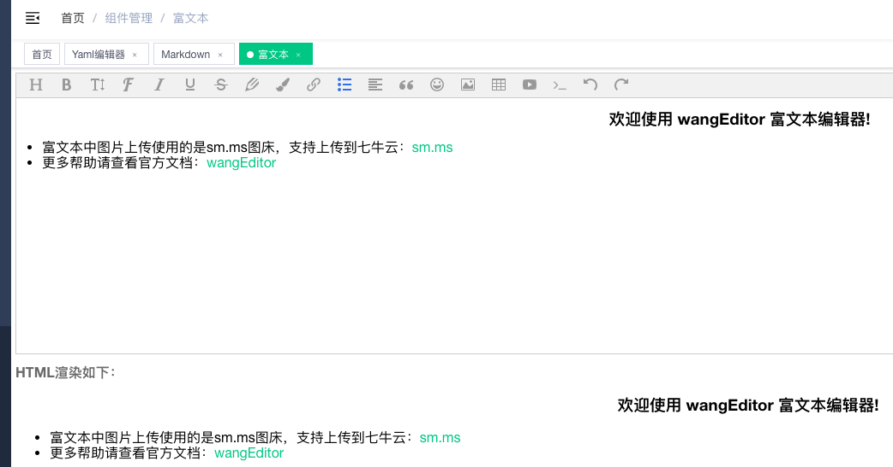

MarkDown
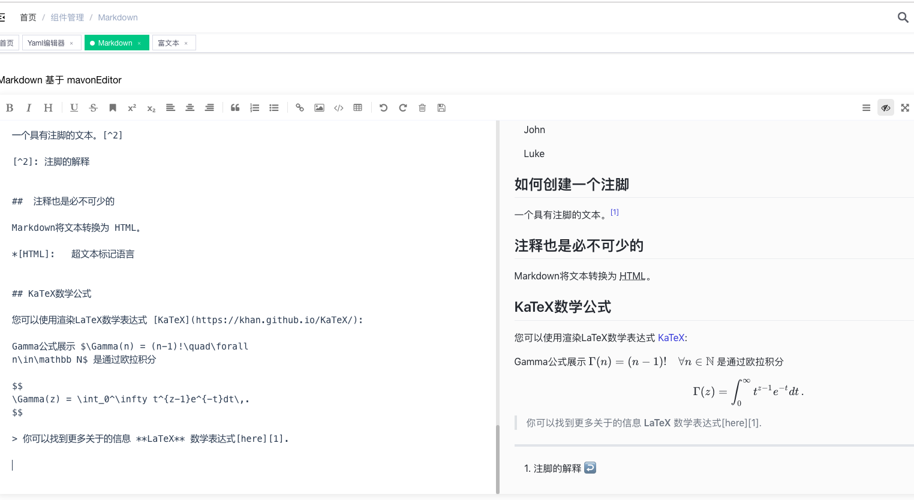

Yaml编辑器
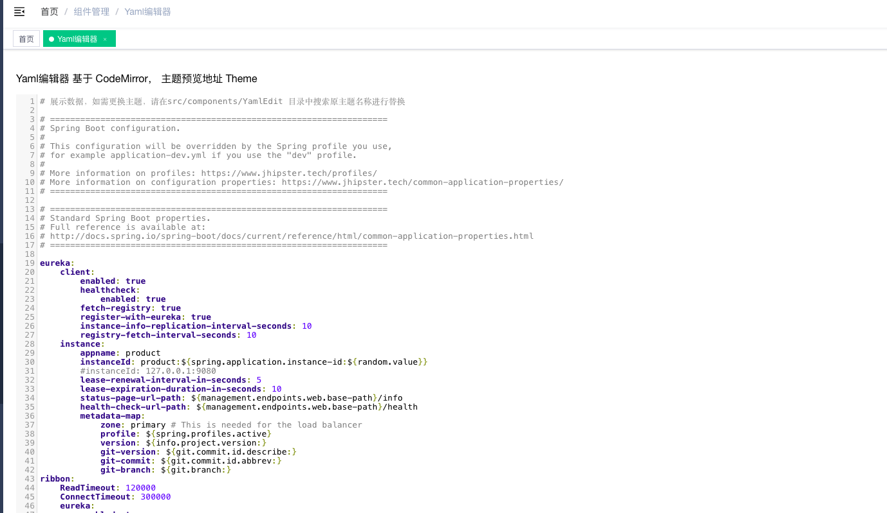
